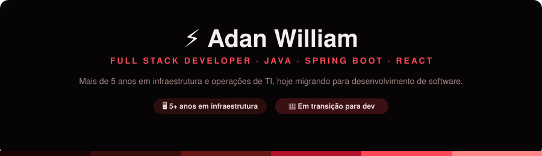
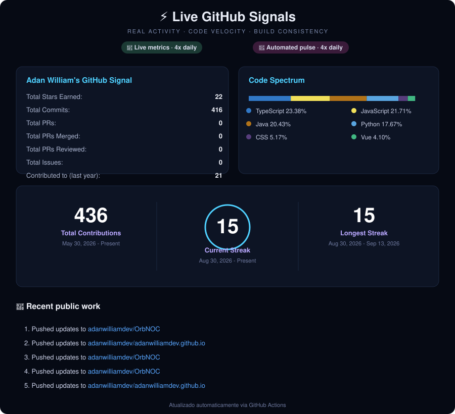

 

&nbsp;&nbsp;

&nbsp;&nbsp;

  

<a href="https://adanwilliamdev.github.io/">🌐 Portfólio</a> · 
<a href="https://www.linkedin.com/in/awosantos/">💼 LinkedIn</a> · 
<a href="https://github.com/adanwilliamdev">🐙 GitHub</a>

## 🚀 Sobre mim

Profissional de TI com mais de **5 anos de experiência em infraestrutura, redes e operações**, atualmente em transição para **desenvolvimento de software**.

Meu foco é **backend com Java e Spring Boot**, construindo APIs REST, autenticação, arquiteturas de microsserviços e integrações com filas, cache e bancos relacionais. No frontend, trabalho com **React** (e às vezes Vue ou Angular) para fechar o ciclo full stack.

A bagagem em infraestrutura me dá uma visão prática de **disponibilidade, observabilidade e comportamento de sistemas em produção** — coisas que aplico mesmo em projetos de estudo.

## 📊 Sinais do GitHub

  

## 🏆 Projetos em Destaque

> Clique no nome do projeto para ver o repositório completo.

### 🛰️ [OrbNOC](https://github.com/adanwilliamdev/OrbNOC)
Plataforma de Network Operations Center para monitoramento de infraestrutura em tempo real: disponibilidade de hosts, latência, jitter, alertas via Telegram, topologia de rede interativa e wallboard modo TV.
**Stack:** Next.js 14 · React · TypeScript · Node.js · Express · Prisma · PostgreSQL · Socket.IO

### 🚗 [AutoCare](https://github.com/adanwilliamdev/autocare)
ERP full stack para oficinas mecânicas: clientes, veículos, ordens de serviço com máquina de estados, orçamentos, controle de estoque transacional e RBAC por perfil.
**Stack:** Java 21 · Spring Boot 3.2 · Spring Security + JWT · PostgreSQL · Flyway · React · TypeScript · Docker

### 🎫 [Ticketing System](https://github.com/adanwilliamdev/ticketing-system)
Sistema de reserva de ingressos com foco em concorrência: locks distribuídos com Redisson, reservas temporárias com expiração, idempotência em pagamentos e testes unitários cobrindo as regras críticas.
**Stack:** Java 21 · Spring Boot · PostgreSQL · Redis · JUnit 5 + Mockito

### 🤖 [Itaú Java AI Order System](https://github.com/adanwilliamdev/itau-java-ai-order-system)
API de processamento de pedidos combinando 4 padrões de projeto (State, Chain of Responsibility, Strategy, Observer) com Spring AI + OpenAI para comandos de voz. Desafio final do programa **Itaú Java AI** (DIO).
**Stack:** Java 17 · Spring Boot · Spring AI · OpenAI (GPT-4o-mini, Whisper)

  

## 💻 Tech Stack

**Backend**
 

**Frontend**
 

**Banco de Dados**
 

**DevOps & Ferramentas**
 

## 🎓 Certificações

- **CI&T — Java AI Copilot** · Digital Innovation One · 53h · Setembro 2026
- **Itaú — Java with Artificial Intelligence** · Digital Innovation One · 45h · Setembro 2026

## 📫 Contato

&nbsp;&nbsp;

&nbsp;&nbsp;

  

⭐ Se algum projeto foi útil, considere deixar uma estrela no repositório.

