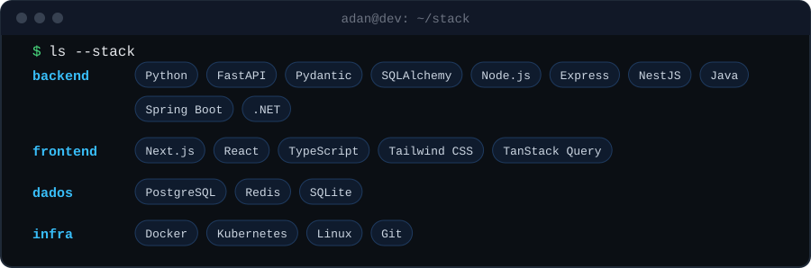

<div align="center">


<br/>


[LinkedIn](https://www.linkedin.com/in/awosantos/) &nbsp;/&nbsp;
[Portfólio](https://adanwilliamdev.github.io/) &nbsp;/&nbsp;
[E-mail](mailto:adan.william.dev@gmail.com) &nbsp;/&nbsp;
[Repositórios](https://github.com/adanwilliamdev?tab=repositories)

</div>

<br/>

## ~/sobre

Desenvolvedor full stack com foco em **Python e dados**, vindo de mais de 5 anos em infraestrutura crítica: atendimento N2/N3 e monitoramento de mais de 13 mil ativos para provedores de Internet. Essa bagagem me dá uma visão prática de **disponibilidade, observabilidade e produção**, que levo para o código.

Construo APIs assíncronas, sistemas em tempo real e aplicações orientadas a dados, sempre com atenção a concorrência, consistência e operação.

```yaml
foco:      Python (FastAPI, Pydantic, SQLAlchemy) + Next.js/TypeScript
constroi:  APIs REST assíncronas, JWT, tempo real (WebSocket/Socket.IO), PostgreSQL e Redis
dados:     Análise e automação de dados com Python
tambem:    Node.js, Java/Spring Boot e .NET
estudando: Kubernetes, AWS, OpenTelemetry, Microsserviços, Design de Sistemas, CI/CD
buscando:  vaga de Desenvolvedor Full Stack Júnior (Python / Dados)
```

<br/>

## ~/projetos

<table>
<tr>
<td width="50%" valign="top">

**[OrbNOC](https://github.com/adanwilliamdev/OrbNOC)**
<br/>Monitoramento de infraestrutura e redes em tempo real: disponibilidade, latência, jitter, perda de pacotes, alertas, SLA, diagnóstico (ping, traceroute, DNS) e wallboard para TV.
<br/><br/>▸ Eleição de líder de monitoramento coordenada pelo Redis
<br/>▸ Tempo real via Socket.IO
<br/>▸ Nasceu da minha rotina de NOC
<br/><br/>`Next.js` `FastAPI` `Socket.IO` `PostgreSQL` `Redis` `Docker`

</td>
<td width="50%" valign="top">

**[SVA — Sua Vaga Aqui](https://github.com/adanwilliamdev/sva-platform)**
<br/>Recrutamento que conecta candidatos e recrutadores, com score de compatibilidade entre currículo e vaga, chat, agendamento de entrevistas e analytics.
<br/><br/>▸ WebSocket nativo + Redis Pub/Sub (multi-instância)
<br/>▸ Validação ponta a ponta com Pydantic v2 e Zod
<br/><br/>`Next.js` `FastAPI` `WebSocket` `PostgreSQL` `Redis` `Docker`

</td>
</tr>
<tr>
<td width="50%" valign="top">

**[AutoCare](https://github.com/adanwilliamdev/autocare)**
<br/>ERP para oficinas mecânicas: clientes, veículos, mecânicos, orçamentos, ordens de serviço e estoque.
<br/><br/>▸ Ordens de serviço com máquina de estados
<br/>▸ Estoque transacional com controle de concorrência por versão
<br/>▸ Acesso baseado em perfis (RBAC)
<br/><br/>`Next.js` `FastAPI` `Alembic` `JWT` `PostgreSQL` `Docker`

</td>
<td width="50%" valign="top">

**[Ticketing System](https://github.com/adanwilliamdev/ticketing-system)**
<br/>Reserva e venda de ingressos pensada para concorrência e consistência transacional.
<br/><br/>▸ Locks distribuídos com Redis e `SELECT ... FOR UPDATE`
<br/>▸ Pagamentos idempotentes
<br/>▸ Expiração automática de reservas
<br/><br/>`Next.js` `FastAPI` `Alembic` `PostgreSQL` `Redis` `Docker`

</td>
</tr>
<tr>
<td width="50%" valign="top">

**[Burger & Pizza House ERP](https://github.com/adanwilliamdev/Burger-Pizza-House)**
<br/>Gestão para pizzarias e hamburguerias, com dashboard de faturamento, mais vendidos e estoque baixo.
<br/><br/>▸ Receitas por ingrediente com baixa automática
<br/>▸ Ciclo de vida completo de pedidos
<br/><br/>`Next.js` `FastAPI` `JWT` `PostgreSQL` `Redis` `Docker`

</td>
<td width="50%" valign="top">

**Mais projetos**
<br/>InfraMonitor, Biblioteca Fullstack, Real Estate Monitor, Scalable Web Scraper, Geo-Explorer (servidor MCP) e projetos em Java/Spring e .NET.
<br/><br/>▸ [Ver todos os repositórios](https://github.com/adanwilliamdev?tab=repositories)
<br/>▸ [Ver portfólio](https://adanwilliamdev.github.io/)

</td>
</tr>
</table>

<details>
<summary>Lista completa de outros projetos</summary>

<br/>

| Projeto | Descrição | Stack |
|:--|:--|:--|
| InfraMonitor | Dashboard de infraestrutura com alertas de CPU, memória e disco | Next.js · FastAPI · PostgreSQL · Redis |
| Biblioteca Fullstack | Catálogo de séries/filmes com progresso e integração TMDB | Next.js · FastAPI · JWT |
| Processamento de Pedidos | API com State, Chain of Responsibility, Strategy e Observer, mais voz via Spring AI | Java 17 · Spring Boot |
| Gestão de Estoque Inteligente | Alertas de baixo estoque via mensageria | .NET 7 · EF Core · RabbitMQ |
| Real Estate Monitor | Previsão de preços de imóveis com ML | Python · FastAPI · Scikit-learn |
| Scalable Web Scraper | Scraper distribuído baseado em filas | Python · Redis · Docker · Kubernetes |
| Geo-Explorer | Servidor MCP de trilhas de aprendizagem com IA | Node.js · TypeScript · MCP SDK |

</details>

<br/>

## ~/stack



<br/>

## ~/experiencia

```text
2020 → 2026   Analista de TI N2/N3 · ConectV
              Ambiente crítico para ISPs, alta disponibilidade e SLA.
              Monitoramento de 13 mil+ ativos, resolução de incidentes e
              participação em projetos de automação e melhoria contínua.

2025 → hoje   Desenvolvimento de software · projetos e formação
              Full stack com Python e Next.js; projetos publicados neste GitHub.
```

<br/>

## ~/formacao

**Graduação:** Análise e Desenvolvimento de Sistemas · UNIFATECIE (2025 – 2027)

**Certificações em destaque**

| Certificação | Instituição |
|:--|:--|
| Python para Análise e Automação de Dados | Accenture |
| Java com Inteligência Artificial · Java AI Copilot | Itaú · CI&T / DIO |
| AI-900: Fundamentos de IA no Azure | Fundação Bradesco |
| Banco de Dados: Oracle PL/SQL | Instituto Federal do RS |
| Certified AI Security & Risk (CAISR) | Red Team Leaders |

<br/>

## ~/contato


<div align="center">

<br/>

[LinkedIn](https://www.linkedin.com/in/awosantos/) &nbsp;/&nbsp;
[Portfólio](https://adanwilliamdev.github.io/) &nbsp;/&nbsp;
[adan.william.dev@gmail.com](mailto:adan.william.dev@gmail.com)

</div>
